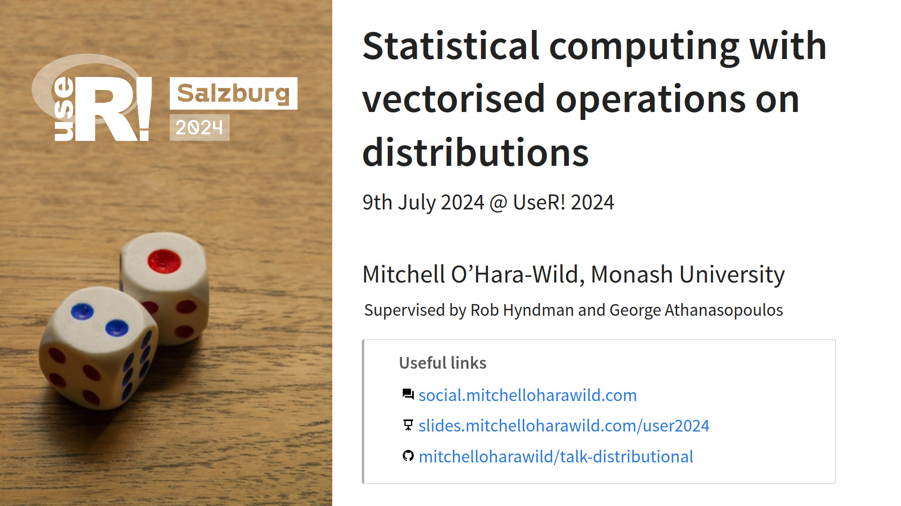

<!-- README.md is generated from README.qmd. Please edit that file -->

# useR! 2024: Statistical computing with vectorised operations on distributions

<!-- badges: start -->
<!-- badges: end -->

Slides and notes for a talk at useR! 2024 (8th - 11th July 2024) in
Salzburg, Austria.

A recording of this presentation is available on YouTube here:
<https://www.youtube.com/watch?v=iM_6_tqTBSg>

#### Abstract

The uncertainty of model outputs is often absent or hidden in R, and
tools for interacting with distributions are limited. For example, most
prediction methods in R only produce point predictions by default.
Although it is possible to obtain other parameters and form the complete
distribution, additional knowledge about the distribution’s shape and
properties are needed. The distributional package vastly simplifies
creating and interacting with distributions in R.

The package provides vectorised distributions and supports the
calculation of various statistics without needing to use shape-specific
d*/p*/q*/r* functions. Statistics can be easily calculated for
distributions in the same vector, regardless of shape. Manipulating
distributions is also supported, including applying transformations,
inflating values, truncating, and creating mixtures of distributions.
When vectors are stored as data frame columns, these operations
integrate seamlessly with tidyverse workflows. Distributions can also be
visualised with ggplot2 using the ggdist extension package, which offers
many graphical representations of uncertainty.

#### Structure

- Examples of current model output
- Introduction to the basics of distributional
- Comparison with other libraries, while revealing more advanced
  functionality
- Examples of practical applications (calculating on distributions,
  ggdist plotting)

### Format

20 minutes total (including Q&A)
